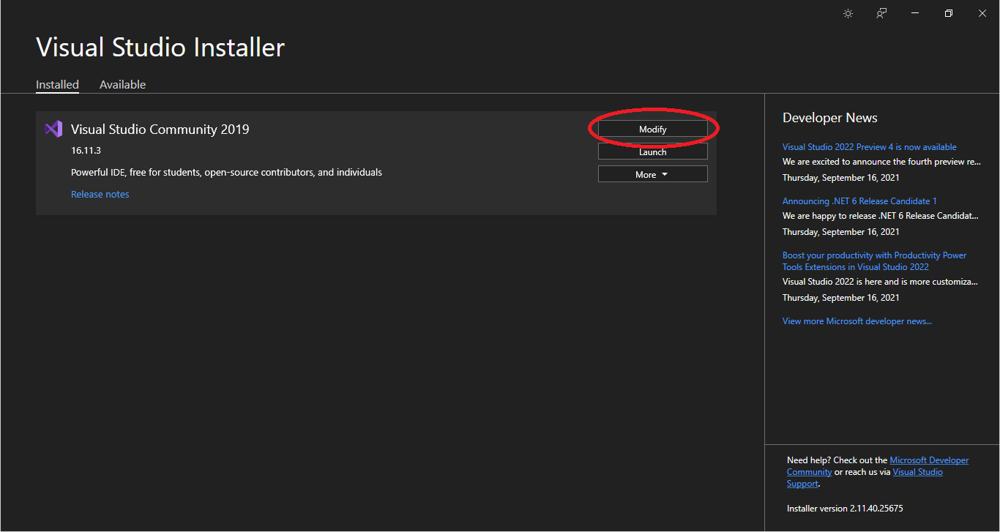
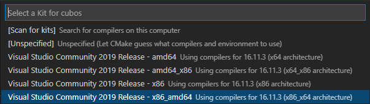
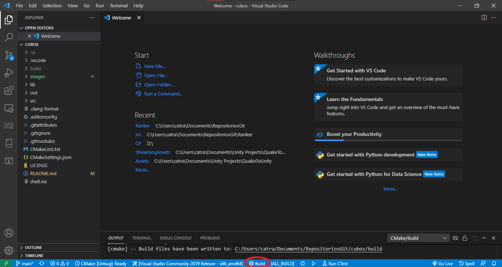

# **CUBOS.** Engine

<p align="center">
  <!-- if we ever get a site, we can put the link here-->
  <!-- <a href="https://godotengine.org"> -->
    
  <!-- </a> -->
</p>

## Voxel based engine

**CUBOS. is a simple, but powerful engine for PC, where everything is made out of voxels.**

**IMPORTANT NOTE:** **CUBOS.** is a work in progress still in its very early stages. This description matches our hopes for the engine, not its current state.

**CUBOS.** is a 3D game engine that is perfect for beginners, but also a powerful tool in the hands of experienced developers.
Its vast render distances and the destructibility it allows set it apart from other engines.
Written in *C++*, built with *OpenGL*, it's a high-performance engine.

## Getting the engine

### Executables

There are no releases of **CUBOS.** so far. We will update this section once we release official binaries.
<!--Official binaries for **CUBOS.** can be found
on the [releases](https://github.com/GameDevTecnico/cubos/releases) page.-->

### Compiling from the source code

#### Downloading 

While you can simply download the code as a zip from the green **Code** button at the top of the repository, downloading via the *git* control system is preferable.

This way, you can easily get the latest version and even contribute to the project yourself. [Here's](https://learngitbranching.js.org/) a great way to learn *git*. Don't forget to [download and install](https://git-scm.com/book/en/v2/Getting-Started-Installing-Git) *git* for your operating system. A GUI client (i.e. [Sourcetree](https://www.sourcetreeapp.com/), [GitKraken](https://www.gitkraken.com/)) is also suggested for beginners.

Here's how you download the code through *git*:

1. Open up your terminal and navigate to the directory where you want **CUBOS.** to be saved.
2. Run the following command (*--recursive* is required so it clones the submodules that **CUBOS.** requires as well.):

``` git clone --recursive https://github.com/GameDevTecnico/cubos.git ``` 

Let it download all the files and complete the operation, and you're done. The entirety of **CUBOS.** is now on that directory.

To compile those files into a working program, you have many options:

#### Compiling

##### Visual Studio

1. Make sure that both the *Desktop development with C++* workload and the optional *C++ CMake Tools for Windows* package is installed with your version of *Visual Studio*. 
To do so, open *Visual Studio Installer* and select **Modify** on the version of VS you plan on using. On the left panel, make sure that the *Desktop development with C++* workload is checked. On the right, under *Desktop development with C++*, make sure *C++ CMake Tools for Windows* is checked. Then click **Modify** at the bottom and let the installation complete.

<p align="center">
    
</p>
<p align="center">
    
</p>

2. Open *Visual Studio* and select the ```Open local folder``` option, and then choose the repository directory. 
3. *CMake* will automatically start configuring the project. Let it do so until it reads ```CMake generation finished.``` in the output window.
4. In the Project Solution window on the right, click on the icon right to the home button (when hovered it says ```Switch between solutions and available views```).

<p align="center">
    
</p>

5. Select ```CMake Targets View``` and then under ```cubos Project``` right-click ```cubos (static library)``` and select **Build**.

##### Visual Studio Code

1. Install *Microsoft's* *[CMake Tools](https://marketplace.visualstudio.com/items?itemName=ms-vscode.cmake-tools)* extension for *Visual Studio Code*.
2. Open the repository folder in *Visual Studio Code*. It will automatically scan your project.
3. On the ```Would you like to configure project 'cubos'?``` prompt thrown by *CMake Tools*, press **Yes**

<p align="center">
    
</p>

4. Then pick a kit for **CUBOS.** This is your preferred compiler.

<p align="center">
    
</p>

5. Finally, on the bar at the bottom, press **Build**. The first time it compiles will take longer.

<p align="center">
    
</p>

##### Terminal

1. Install *[CMake](https://cmake.org/install/)* on your terminal.
2. Open your terminal and navigate to the *cubos* directory.
3. Run the following commands:

```cmake -H. -Bbuild```

```cmake --build build```

Also, you can use versions of the required libraries that are installed on your computer already, outside the repository. This makes the compiling process faster. Just don't use the ```--recursive``` flag when cloning the repository, and install the dependencies yourself. Then instead of the commands above, run the following: 

```cmake -H. -Bbuild -DGLFW_USE_SUBMODULE=OFF -DGLM_USE_SUBMODULE=OFF -DYAMLCPP_USE_SUBMODULE=OFF```

### Testing

We use GoogleTest for unit testing the engine source.
All tests should be inside *tests* directory.

CMakeLists.txt builds a test executable that can be run using ctest:

```cd build && ctest ```

## Who is making this engine

We are  [Gamedev Técnico](https://www.instagram.com/gamedevtecnico/), a student group from [Instituto Superior Técnico](https://tecnico.ulisboa.pt/en/) who makes games. Our goal is to build a game engine from the ground up. 

Find us at:

[Twitter](https://twitter.com/GameDevTecnico)

[Facebook](https://www.facebook.com/Game-Dev-T%C3%A9cnico-107405047487324/)

[Instagram](https://www.instagram.com/gamedevtecnico/)

[Youtube](https://www.youtube.com/channel/UCpJf5Ih7SE9wAgaZ_OF9qYA)

[itch.io](https://gamedevtecnico.itch.io/)

