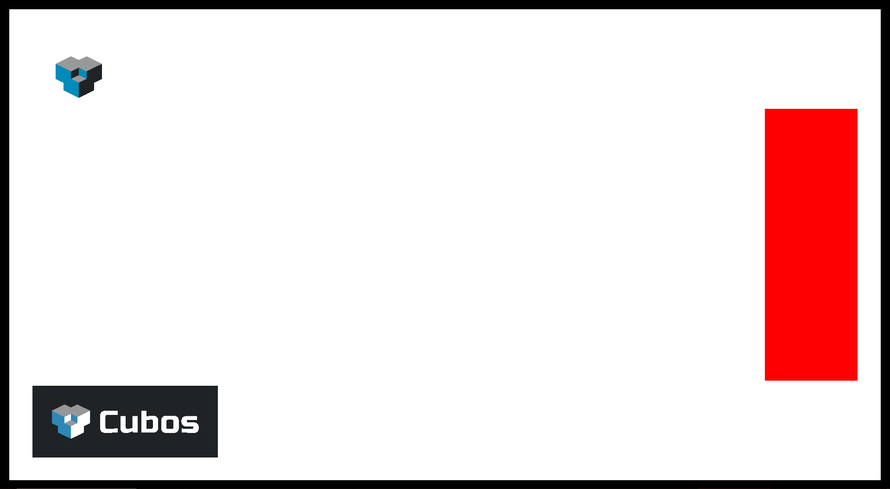

# UI {#examples-engine-ui}

@brief Using the @ref ui-canvas-plugin plugin.

@see Full source code [here](https://github.com/GameDevTecnico/cubos/tree/main/engine/samples/ui).

This example shows how the @ref ui-canvas-plugin plugin can be used to create ui elements on screen. It also uses the @ref ui-color-rect-plugin plugin to draw those elements to screen.

@snippet ui/main.cpp Set up Canvas

We start by setting up a @ref cubos::engine::UICanvas. This will serve as a target to which the elements will be drawn to.

@snippet ui/main.cpp Set up Background

Now we can set up a background, with a @ref cubos::engine::UIElement. We want it to cover the whole screen, so we'll add both a @ref cubos::engine::UIHorizontalStretch and a @ref cubos::engine::UIVerticalStretch componenets. These will make sure our background's size will always match that of the canvas. For extra style, we can add a little border around it, by setting the margins of the components to 20.

We can add a @ref cubos::engine::UIColorRect to that entity and have the background be drawn in white.

Finally, we have to set this UIElement as a child of the entity holding the canvas.

Besides the stretch components, the @ref cubos::engine::UIElement has some fields to control its placement.

@snippet ui/main.cpp Set up Panel

Here we create a small panel to the right side of the screen. The anchor is set to `1, 0.5`. This will mean that the panel's pivot will be placed on the very right edge of its parent, and in the middle vertically. Then the pivot itself is set to also be `1, 0.5`. This will mean that the UIElement will "grow" to the left horizontally, and equally up and down vertically. This is because by setting that value, we are effectively telling the UI element its pivot will be on its right edge, in the middle point of it. We set the offset to be `0, -50`, so that we leave a little space to the right of the it before the edge of its parent. This space will be constant regardless of the parent's size. Finally, we se the size of the element to be `200, 600`.

We set this panel as child of the background, and we'll paint it red.

