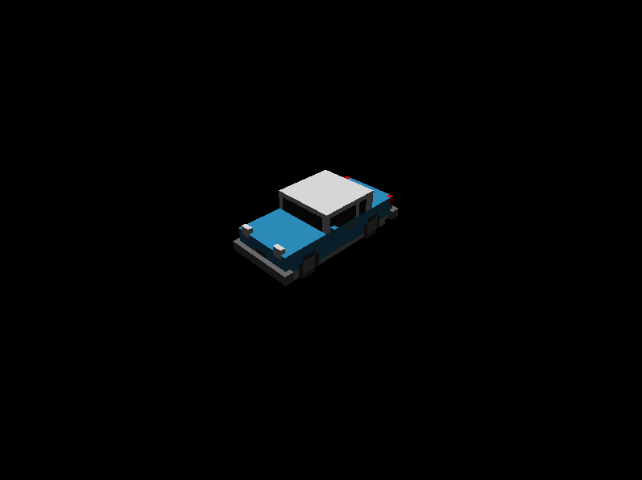

# Voxels {#examples-engine-voxels}

@brief Using the @ref voxels-plugin plugin.

@see Full source code [here](https://github.com/GameDevTecnico/cubos/tree/main/engine/samples/voxels).

This example shows the @ref voxels-plugin plugin, which registers asset bridges used to load voxel grids (`.grid`) and palettes (`.pal`). Check out the @ref examples-engine-assets-bridge sample for an introduction on the @ref assets-plugin plugin.

It is very similar to the @ref examples-engine-renderer, differing only in the fact that in this sample the grid and palette are loaded from files.

The plugin function is included from the @ref engine/voxels/plugin.hpp header.
To see the asset, you'll also need to perform a basic configuration of the @ref renderer-plugin plugin like shown in the @ref examples-engine-renderer sample.

@snippet voxels/main.cpp Adding the plugin

Lets start by defining the handles of the assets we want to use, as done in the @ref examples-engine-assets sample.

@snippet voxels/main.cpp Get handles to assets

In this sample, instead of creating a new palette, we just read the data from the asset identified from the `PaletteAsset` handle we defined previously. Internally, the @ref cubos::engine::Assets "assets manager" will automatically load the palette asset if it hasn't been loaded before.

@snippet voxels/main.cpp Load and set palette

Now, we can create an entity with our car asset. 

@snippet voxels/main.cpp Spawn car system

And voilá, you now have a car floating in space.
